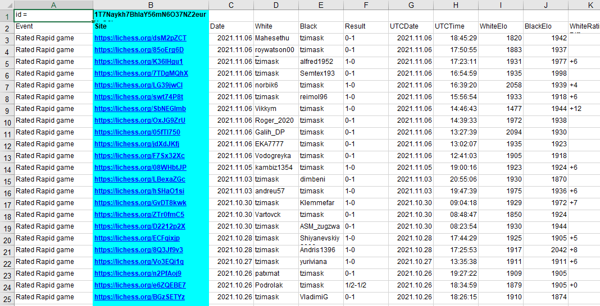
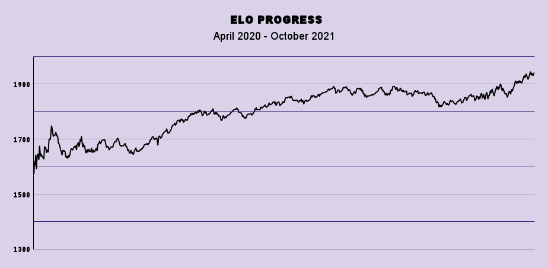
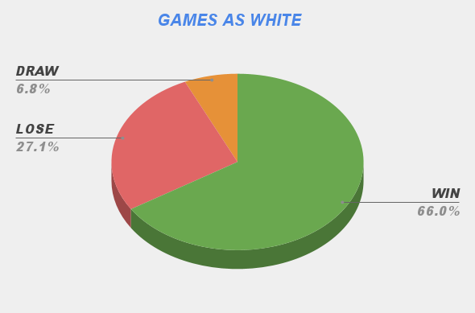
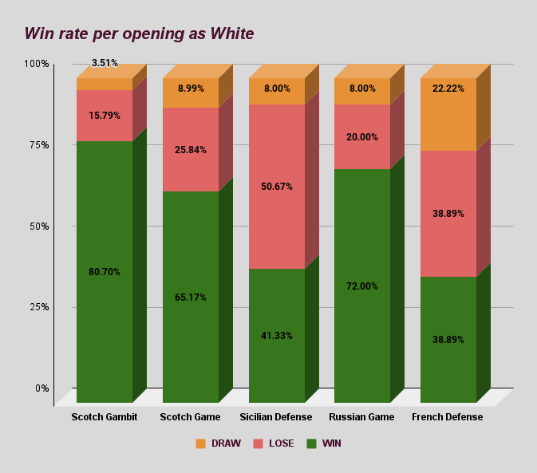
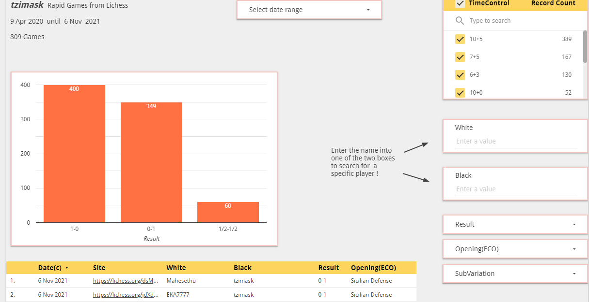

# Student-Chess-Games Analysis

## Project overview

This project focuses on analyzing my student's performance in rapid chess games. The analysis includes:  
- Overall Performance Evaluation: Assessing the student's progress and game outcomes.
- Elo Rating and Win Rate Visualization: Creating graphs and charts to display the student's Elo rating development and win/loss statistics.
- Presentation and Interactive Dashboard: Developing a presentation and an interactive dashboard to effectively communicate the analysis findings. 
Tools Used: Google Sheets, Google Slides, Google Data Studio, Power BI.

## Prepare phase
I downloaded the game data from lichess.org. Since the games were in PGN format, I found a useful script to import them directly into Google Sheets!

## Process Phase
The data presented is in its raw format, as exported to an XLSX file. You can access it here: **[Link](https://github.com/DimKaisaris/Student-Chess-Games/blob/main/Raw%20Files/Copy%20of%20lichess.org.xlsx)** 

The data cleaning process followed the steps outlined in the **[Copy of Cleaning Log](https://github.com/DimKaisaris/Student-Chess-Games/blob/main/Processed%20Files/Copy%20of%20Cleaning%20Log.docx)**
All modifications made during the Processing and Analysis phases were documented in the **[Change Log Tzimas.K](https://github.com/DimKaisaris/Student-Chess-Games/blob/main/Processed%20Files/Change%20Log%20Tzimas.K.docx)**

## Analysis Phase 
The analysis involved utilizing various functions and techniques within the spreadsheet software to extract meaningful insights from the processed data. This included creating charts and pivot tables to visualize and summarize key trends and patterns.
The final spreadsheet, in XLSX format, can be accessed here: **[Rapid Games(K. Tzimas)](https://github.com/DimKaisaris/Student-Chess-Games/blob/main/Processed%20Files/Rapid%20Games%20(K.%20Tzimas).xlsx)**   
Here's some images.

### 1)Elo Graph

### 2) Games as White

### 3) Openings as White

## Share Phase
To share the analysis results, I developed the following: 
Presentation: A presentation detailing the key findings, available here:  **[presentation](https://github.com/DimKaisaris/Student-Chess-Games/blob/main/Presentation/Rapid%20Games%20presentation(%20tzimask).pptx)**
Interactive Dashboard: An interactive dashboard in Power BI, accessible via this link:  **[Power BI](https://github.com/DimKaisaris/Student-Chess-Games/blob/main/Processed%20Files/Tzim_PBI.pbix)**

